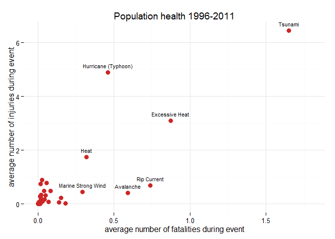

# Storm Event Analysis Shows Tsunamis Are Most Harmfull For Population Health
Joris Eekhout  
Thursday, May 21, 2015  

# Synopsis
An analysis is made of NOAA's Storm Events Database. The database consists of data related to the major storm events in the United States, recorded since 1950. The data analysis focuses on data from 1996-2011. The analysis shows that different event types cause different kinds of damage. The most harmful for population health are Tsunamis. Other notable events are Heat, Exessive Heat, Rip Current, Avalanche, Marine Strong Wind, and Huricane (Typhoon). The latter causes also the most economic damage. 

# Storm Events Database
The Storm Events Database contains the records used to create the official NOAA Storm Data publication, documenting: 

* The occurrence of storms and other significant weather phenomena having sufficient intensity to cause loss of life, injuries, significant property damage, and/or disruption to commerce;

* Rare, unusual, weather phenomena that generate media attention, such as snow flurries in South Florida or the San Diego coastal area; and

* Other significant meteorological events, such as record maximum or minimum temperatures or precipitation that occur in connection with another event.

The database currently contains data from January 1950 to January 2015, as entered by NOAA's National Weather Service (NWS). Due to changes in the data collection and processing procedures over time, there are unique periods of record available depending on the event type. NCDC has performed data reformatting and standardization of event types but has not changed any data values for locations, fatalities, injuries, damage, narratives and any other event specific information. Please refer to the Database Details page for more information. 

(source: [http://www.ncdc.noaa.gov/stormevents/](http://www.ncdc.noaa.gov/stormevents/))

# Data Processing
The original dataset was downloaded from the course website and stored locally. The following code reads the data.

```r
setwd("D:/personal/courses/data science/5. reproducible research/assessments/assessment 2/")
if (!file.exists("repdata-data-StormData.csv.bz2")) {
    fileUrl <- "https://d396qusza40orc.cloudfront.net/repdata%2Fdata%2FStormData.csv.bz2"
    download.file(fileUrl, destfile = "./repdata-data-StormData.csv.bz2")
}
eventData <- read.csv("repdata-data-StormData.csv.bz2")
```

## Available Data
Not all event types have been recorded since the start of this survey. NOAA's [Storm Events Database](http://www.ncdc.noaa.gov/stormevents/details.jsp?type=eventtype "Storm Events Database") website shows that tornado's have been registered since the start of the start of the survey in 1950. Other events followed in 1955. Since 1996 all 48 events are recorded. Therefore, in this analysis only the data available since 1996 will be used.

An new data variable is created (**beginDate**) that contains the begin dates (from the **BGN_DATE** variable) in POSIXlt format. The new variable is kept out of the data frame **eventData** to prevent problems with the *dplyr* package. A logical variable is created (**availableData**) that shows which begin dates are later than the January 1, 1996. Those data will be used in further analysis.

```r
beginDate <- strptime(eventData$BGN_DATE, format = "%m/%d/%Y %H:%M:%S")
eventData$availableData <- FALSE
eventData$availableData[beginDate>as.POSIXlt("1996-01-01")] <- TRUE

sumAvailableData <- sum(eventData$availableData)
percentageAvailableData <- round(sumAvailableData/(nrow(eventData))*100, 1)
```

In total 653507 data entries are used in this analysis. This is 72.4% of the total number of data entries.

## Event Types

```r
levelsEVTYPE <- length(levels(eventData$EVTYPE))
```

The data set contains a total number of 985 event types. The National Weather Service Storm Data Documentation identifies 48 different storm data events. Each storm data event consists of a name and a designator, the latter gives information on the location of the event. There are three designators: C - County/Parish; Z - Zone; and M - Marine. To comply with the list provided in this documentation, a look-up table is created: *EVTYPE.csv*. Most of the original storm data events could be replaced by any of the 48 types. The remainder were classified as "Other", with a designator of "O". All 49 event types are also stored in another file *stormEvents.csv*. 

The following code checks if the two files are currently in the working directory. In case they are not yet available, the files will be downloaded and stored locally in the working directory. The data of both files are loaded into R. The code below also loops through the original **EVTYPE** variable of the **eventData** data frame. The for-loop assigns the new event type names to the **EVTYPE.New** variable and the designator to the **Designator** variable.


```r
if (!file.exists("stormEvents.csv")) {
    fileUrl <- "https://github.com/JorisEekhout/RepData_PeerAssessment2/blob/master/stormEvents.csv"
    download.file(fileUrl, destfile = "./stormEvents.csv")
}
stormEvents <- read.csv("stormEvents.csv")

if (!file.exists("EVTYPE.csv")) {
    fileUrl <- "https://github.com/JorisEekhout/RepData_PeerAssessment2/blob/master/EVTYPE.csv"
    download.file(fileUrl, destfile = "./EVTYPE.csv")
}
lookUpTable <- read.csv("EVTYPE.csv")

for (i in seq(along=lookUpTable$EVTYPE.Original)) {
    eventData$EVTYPE.New[as.character(eventData$EVTYPE)==as.character(lookUpTable$EVTYPE.Original[i])] <- as.character(lookUpTable$EVTYPE.New[i])
    eventData$Designator[as.character(eventData$EVTYPE)==as.character(lookUpTable$EVTYPE.Original[i])] <- as.character(lookUpTable$Designator[i])
}

eventData$EVTYPE.New <- as.factor(eventData$EVTYPE.New)
```

## Property and Crop Damage
The data set contains two variables that contain data related to economic damage, i.e. **PROPDMG** and **CROPDMG**, which refer to property damage and crop damage, respectively. Both variables are connected to a second variable that contains additional information regarding the exponent of the damage variable. These variables are **PROPDMGEXP** and **CROPDMGEXP**. To determine the appropiate damage value, the values from **PROPDMG** and **CROPDMG** need to be multiplied by 10 to the power the exponent of **PROPDMGEXP** and **CROPDMGEXP**. The new values will be stored in two new variables **propertyDamage** and **cropDamage**. Besides exponents, **PROPDMGEXP** and **CROPDMGEXP** also contain letters, refering to a multiplication value. These letters include: 

* h/H: 10^2

* k/K: 10^3

* m/M: 10^6

* b/B: 10^9

These letters will first be transformed into the right number and then multiplied with the values from **PROPDMG** and **CROPDMG** to get the proper values for the damage. Variables **PROPDMGEXP** and **CROPDMGEXP** also contain other characters (i.e. "", "-", "?", and "+"). The values containing "" are considered to have an exponent of 0. All the other character values will be discarded from the analysis.


```r
eventData$propertyExp <- as.numeric(eventData$PROPDMGEXP)
eventData$propertyExp[eventData$PROPDMGEXP == ""] <- 0
eventData$propertyExp[eventData$PROPDMGEXP == "h" | eventData$PROPDMGEXP == "H"] <- 2
eventData$propertyExp[eventData$PROPDMGEXP == "k" | eventData$PROPDMGEXP == "K"] <- 3
eventData$propertyExp[eventData$PROPDMGEXP == "m" | eventData$PROPDMGEXP == "M"] <- 6
eventData$propertyExp[eventData$PROPDMGEXP == "b" | eventData$PROPDMGEXP == "B"] <- 9
eventData$propertyExp[eventData$PROPDMGEXP == "-" | eventData$PROPDMGEXP == "?" | eventData$PROPDMGEXP == "+"] <- NA
eventData$propertyDamage <- eventData$PROPDMG*10^eventData$propertyExp

eventData$cropExp <- as.numeric(eventData$CROPDMGEXP)
eventData$cropExp[eventData$CROPDMGEXP == ""] <- 0
eventData$cropExp[eventData$CROPDMGEXP == "h" | eventData$CROPDMGEXP == "H"] <- 2
eventData$cropExp[eventData$CROPDMGEXP == "k" | eventData$CROPDMGEXP == "K"] <- 3
eventData$cropExp[eventData$CROPDMGEXP == "m" | eventData$CROPDMGEXP == "M"] <- 6
eventData$cropExp[eventData$CROPDMGEXP == "b" | eventData$CROPDMGEXP == "B"] <- 9
eventData$cropExp[eventData$CROPDMGEXP == "-" | eventData$CROPDMGEXP == "?" | eventData$CROPDMGEXP == "+"] <- NA
eventData$cropDamage <- eventData$CROPDMG*10^eventData$cropExp
```

# Results
The objective of this study is to show the events that are either most harmful with respect to the population health, or have the greatest economic consequences. These two topics will be evaluated in the following two sections.

## Population Health

The data set contains two variables that say something about the population health, i.e. **FATALITIES** and **INJURIES**, which, respectively, report the total number of fatalities and injuries during the recorded event. Below you will find the analysis that calculates the average number of fatalities and injuries across all event types. The data is subsetted to only use the available data after January 1, 1996.


```r
library(dplyr)

eventHealth <- eventData[eventData$availableData, ] %>% group_by(EVTYPE.New) %>% summarize(fatalities = mean(FATALITIES, na.rm = TRUE), injuries = mean(INJURIES, na.rm = TRUE))
eventHealth <- eventHealth[1:nrow(stormEvents), ]
```

The data are reported in a scatter plot, with on the x-axis the average number of fatalities and on the y-axis the average number of injuries. Several event types stand out and are labeled. The events with an average number of fatalities larger than 0.25 and/or an average number of injuries larger than 2 are labeled.


```r
eventHealth$fatalitiesTop <- eventHealth$fatalities>0.25
eventHealth$injuriesTop <- eventHealth$injuries>2
eventHealth$plotTop <- eventHealth$injuriesTop == TRUE | eventHealth$fatalitiesTop == TRUE
for (i in seq(eventHealth$EVTYPE.New)) {
    eventHealth$designator[i] <- as.character(stormEvents$designator[stormEvents$stormEvent == eventHealth$EVTYPE.New[i]])
}

library(ggplot2)

ggplot(eventHealth, aes(fatalities, injuries)) + geom_point(size = 3, color="firebrick3") + theme_minimal() + geom_text(data=eventHealth[eventHealth$plotTop, ], aes(label = EVTYPE.New), vjust = -1, size = 3) + labs(title = "Population health 1996-2011", x = "average number of fatalities during event", y = "average number of injuries during event") + xlim(c(0, 1.8))
```

 

The figure below shows the average number of fatalities and injuries for all event types. The figure clearly shows that seven event types stand out of the rest of the events. The figure shows that Tsunami is the event type with both the highest average number of fatalities as the highest number of injuries. This event type can therefore be labeled as the event type that is most harmful with respect to the population health. 

## Economic Consequences
The data set contains two variables that account for the economic consequences of the storm events, i.e. property damage and crop damage. The data are stored in the **propertyDamage** and **cropDamage** variables. Below is the code that calculates the average property and crop damage, specified per event type. The values are divided by 1 milion for plotting purposes.


```r
library(dplyr)

eventEconomy <- eventData[eventData$availableData, ] %>% group_by(EVTYPE.New) %>% summarize(propertyDamage = mean(propertyDamage, na.rm = TRUE)/1e+6, cropDamage = mean(cropDamage, na.rm = TRUE)/1e+6)
eventEconomy <- eventEconomy[1:nrow(stormEvents), ]
```

The data are reported in a scatter plot, with on the x-axis the average property damage and on the y-axis the average crop damage, both in milion dollars. Several event types stand out and are labeled. The events with an average property damage larger than 50 milion dollar and/or an average crop damage larger than 5 milion dollar are labeled.


```r
eventEconomy$propertyDamageTop <- eventEconomy$propertyDamage>50
eventEconomy$cropDamageTop <- eventEconomy$cropDamage>5
eventEconomy$plotTop <- eventEconomy$propertyDamageTop == TRUE | eventEconomy$cropDamageTop == TRUE
for (i in seq(eventEconomy$EVTYPE.New)) {
    eventEconomy$designator[i] <- as.character(stormEvents$designator[stormEvents$stormEvent == eventEconomy$EVTYPE.New[i]])
}

library(ggplot2)

ggplot(eventEconomy, aes(propertyDamage, cropDamage)) + geom_point(size = 3, color="firebrick3") + theme_minimal() + geom_text(data=eventEconomy[eventEconomy$plotTop, ], aes(label = EVTYPE.New), vjust = -1, size = 3) + labs(title = "Economic consequences 1996-2011", x = "average property damage (milion dollars)", y = "average crop damage (milion dollars)") + xlim(c(0, 350)) + ylim(c(0, 23))
```

 

The figure shows that a total of 3 events stand out, i.e. Drought, Hurricane (Typhoon), and Storm Surge/Tide. Overall, the event type Hurricane (Typhoon) causes on average the most property and crop damage. The other two event types causes both a different kind of damage. Drought only causes crop damage and Storm Surge/Tide only causes property damage. This should be a surprise. In the case of Drought, houses and other buildings are not affected, however, agricultural land is affected by drought and causes the main damage. Storm Surge/Tide mainly affect land areas near the coast. Agricultural activities are very low in these areas, hence, the crop damage is minimal in the case of this event type.

# Conclusions
The analysis shows that different event types cause different kinds of damage. The most harmful for population health are Tsunamis. Other notable events are Heat, Exessive Heat, Rip Current, Avalanche, Marine Strong Wind, and Huricane (Typhoon). The latter causes also the most economic damage. 
